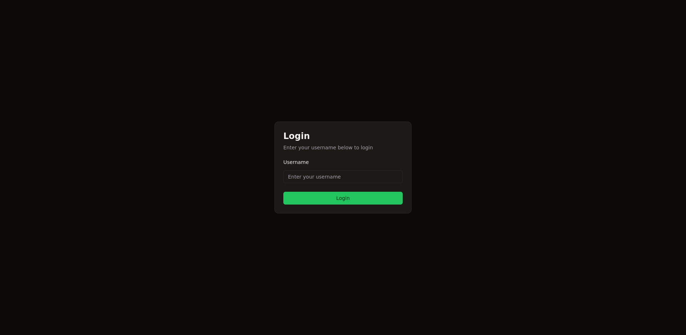
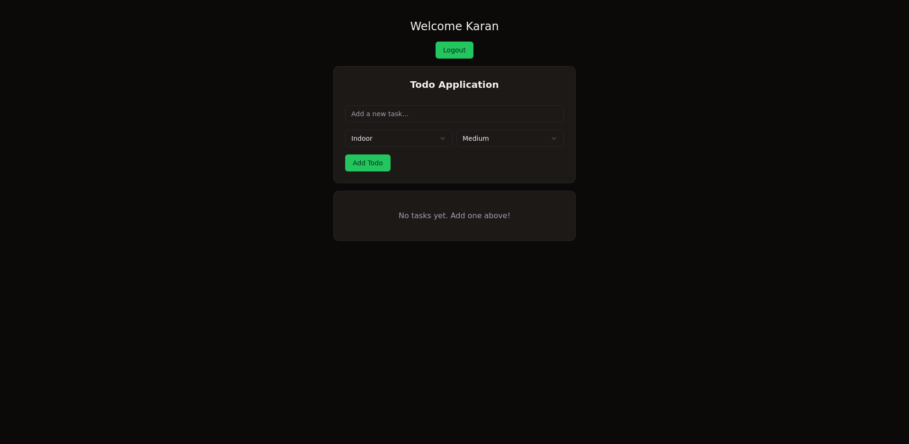
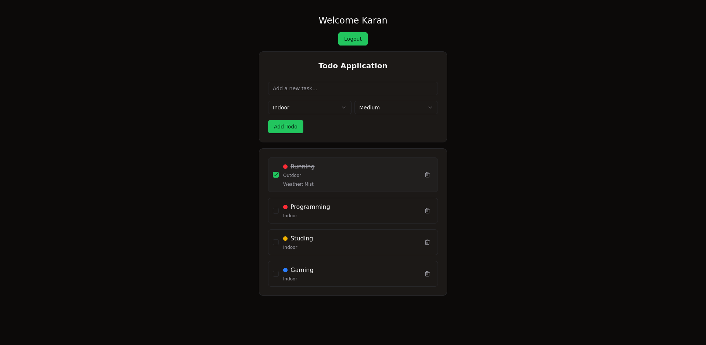

# Todo Application

Basic Todo application where user can give todo title as input and select activity of the todo ie (outdoor or indoor) and also select todo priority(high, medium, low).

If Todo has outdoor activity set,  weather condition of that day will fetch and show the result(The location i have set to "india".)

All the todos will sort by priority order high -> medium -> low


## Run Locally

Clone the project

```bash
  git clone https://github.com/karanShaw000/todo-application.git
```

Go to the project directory

```bash
  cd todo-application
```

Install dependencies

```bash
  npm install
```

Make a .env.local file and paste the content of .env.sample to .env.local

```bash
  touch .env.local && cp .env.sample .env.local
```

I have used [Weather Api](https://www.weatherapi.com/) to get weather condition.
We have to get the api key from the weather api and paste the key to .env.local file.

Start the server

```bash
  npm run dev
```


## Screenshots








